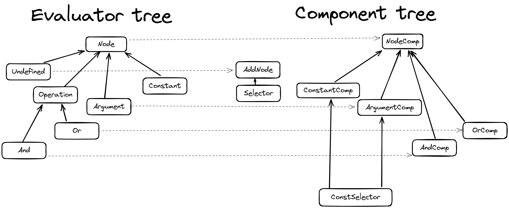

# Boolean expression evaluator

## to start
```shell
npm install
npm start
```

## to test
```shell
npm test
```

## Design decisions
### Two trees
- one tree to represent the nodes that hold the methods to evaluate - evaluator tree
- a second tree to just render the components based on the real tree - component tree

benefits 
- major benefits of then allowing for multiple implementation of the evaluator tree - e.g. show a diagram 
- allows for partial calculation and evaluation 

### Class components rather than functional
- started with functional but wanted to use useContext to pass the evaluator tree
- however, all hooks are dependent on call order, and having conditional rendering did not allow that
- since this is a hook problem, implementing Context in classes solves this issue

### Violating the immutability of state
- since the state of the evaluator classes is passed in context holding pointers to different parts of the tree, 
by calling the getParent we are able to access the exact place and replace it in the whole tree.
- it is a calculated risk as right after we are creating a deep copy of the state and setting the state 
to rerender.

Benefits
- allows for not traversing through the whole tree


## Architecture of trees


## File structure
```
...
src 
|_ components # all components 
  |_ createArguments # components for createArgument section
  |_ tree # all components needed for component tree
|_ evaulator # all classes needed for evaluator tree
```

## Things to improve
### component tree alignment with evaluator tree
- for some edge cases the alignment is not perfect which results in bugs like not being able to remove a section or after selecting an operation, nothing happens
- writing more tests would probably fix that

### Arguments
- argument names should be unique (not validated)
- using the same argument twice evaluates correctly but the value is not visually updated
- edit of value can be done only in the expression rather than in the arguments section
